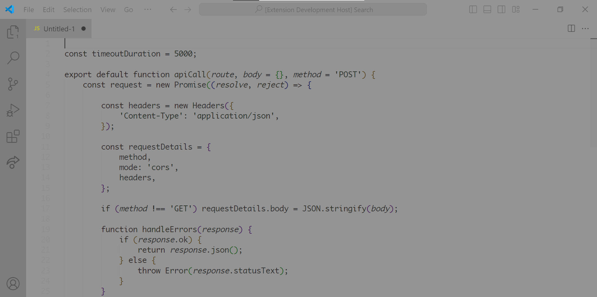

# Black on Gray

It doesn't matter if it's the text color (dark themes) or the background color (light themes), **white** screen light *fries* your eyes whether you notice that or not. I am more sensitive to it thus I have created this theme to irradicate any white at least while using VSCode. The theme should also enhance productivity in the ways mentioned below.

## Preview

Example taken from https://github.com/PacktPublishing/JavaScript-by-Example/blob/master/Chapter07/CompletedCode/src/services/api/apiCall.js

## Design choices and their reasons

### The text is darkest
The reason for this is 100% of the time you focus on the text and 0% of the time you focus on the background. Hence your eyes will be affected most by the text color. If the text was instead lighter than the background, you'd strain your eyes reading light colored text.

### There is hardly any color.
Color is a top source of **distraction** which is why it's almost absent in this theme. Your subconsious is very easily affected by colors and if they aren't chosen right, they will negatively impact your productivity. So I believe that the absense of colors is a much **safer** option than poorly chosen colors. If you are bent on having color but appreciate this theme you may fork it on Theme Studio, which will allow you to edit it: https://themes.vscode.one/theme/Kram/oZodIUQl

### Most elements are faded
This is to put as much attention on the code as possible. Most optional elements, including line number and indentation guides, are faded to not distract the user while working. They haven't been removed completely so if you ever need them, you can still see them.